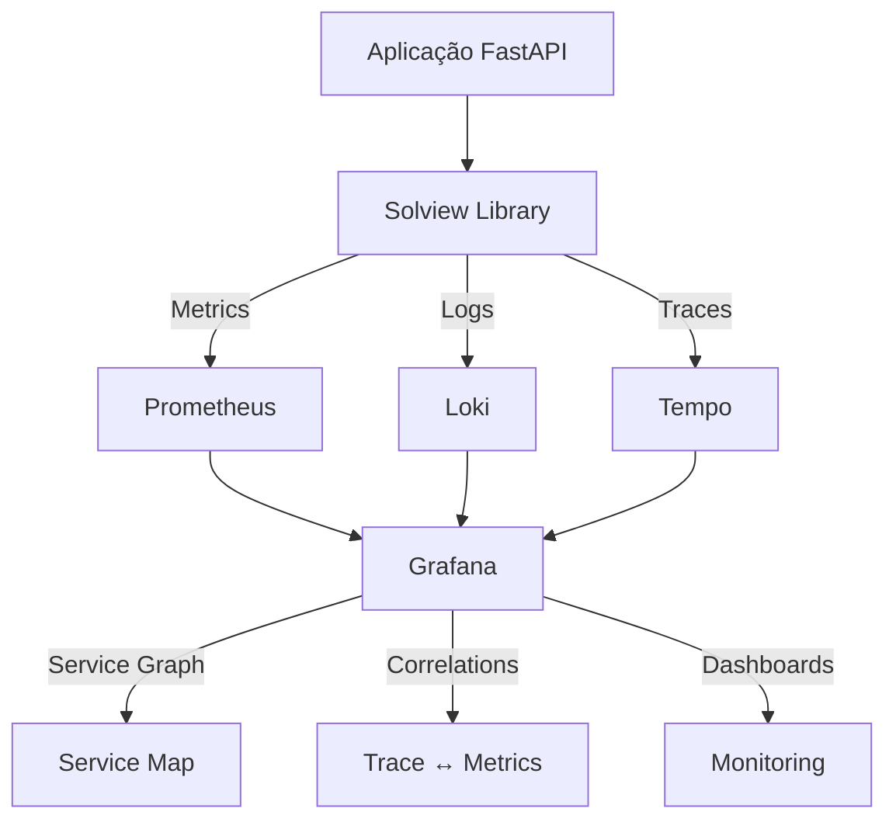

# 🎯 Solview - Observabilidade de Classe Empresarial

[](https://python.org)
[](https://fastapi.tiangolo.com)
[](https://opentelemetry.io)
[](https://grafana.com)
[](LICENSE)

## 🎯 Visão Geral

O **Solview** é uma biblioteca Python de observabilidade empresarial que implementa os **três pilares da observabilidade** (Métricas, Logs, Traces) com **correlação automática** e **instrumentação zero-code** para aplicações FastAPI.

### ✨ Principais Características

- 🔄 **Correlação Automática**: Traces, logs e métricas automaticamente correlacionados
- 📊 **Métricas Padronizadas**: Compatível com OpenTelemetry e Prometheus
- 🔍 **Traces Distribuídos**: Rastreamento completo de requisições cross-service
- 📝 **Logs Estruturados**: JSON estruturado com campos padronizados
- 🔒 **Masking de Dados**: Proteção automática de dados sensíveis
- 🚀 **Zero Configuration**: Instrumentação automática via decorators
- 🎯 **Service Graph**: Visualização automática da topologia de serviços
- ⚡ **Performance**: Otimizado para alta throughput e baixa latência

---

## 🏗️ Arquitetura



---

## 🚀 Quick Start

### 1. Instalação

```bash
pip install solview
```

### 2. Variáveis de Ambiente

Copie o template e ajuste os valores para seu ambiente:

```bash
cp config/solview.env.example .env
```

### 3. Instrumentação Básica

```python
from fastapi import FastAPI
from solview import SolviewSettings, setup_logger, setup_tracer
from solview.metrics import SolviewPrometheusMiddleware, prometheus_metrics_response

# Configuração
settings = SolviewSettings()

# Criar aplicação
app = FastAPI(title="Minha API")

# Instrumentação Solview
setup_logger(settings)
setup_tracer(settings, app)
app.add_middleware(SolviewPrometheusMiddleware, settings=settings)
app.add_route("/metrics", prometheus_metrics_response)

@app.get("/health")
async def health():
    return {"status": "healthy"}
```

### 4. Execução com Observabilidade

```bash
# Iniciar stack de observabilidade
docker-compose up -d

# Executar aplicação
uvicorn main:app --reload

# Acessar dashboards
open http://localhost:3000  # Grafana
```

---

## 📚 Documentação Completa

### 🎯 **Guias de Implementação**
- [📋 **Guia de Instrumentação**](docs/instrumentation-guide.md) - Como instrumentar sua aplicação
- [🚀 **Guia de Deployment**](docs/deployment-guide.md) - Deploy em produção
- [🏗️ **Arquitetura e Componentes**](docs/architecture.md) - Visão técnica detalhada

### 🔧 **Configuração**
- [⚙️ **Configurações Avançadas**](docs/universal-configuration-guide.md) - Todas as opções de configuração
 
- [☸️ **Deploy com Helm**](docs/helm-deployment.md) - Kubernetes e Helm

### 📊 **Observabilidade**
- [📈 **Métricas**](docs/metrics.md) - Métricas disponíveis e customização
- [📝 **Logging**](docs/logging.md) - Estrutura de logs e configuração
- [🔍 **Tracing**](docs/tracing.md) - Traces distribuídos
- [🔗 **Correlação de Dados**](docs/trace-correlation-guide.md) - Como funciona a correlação

### 🎛️ **Grafana e Dashboards**
- [📊 **Service Graph**](docs/service-graph-explanation.md) - Visualização da topologia
- [🔗 **Correlação no Grafana**](docs/grafana-correlation-setup.md) - Setup de correlações
- [📈 **Dashboards**](docs/dashboards.md) - Dashboards prontos

### 🏢 **Uso Empresarial**
 - [🔒 **Masking de Dados**](docs/masking.md) - Proteção de dados sensíveis
- [🔄 **Migração v2**](docs/migration-v2.md) - Migração de versões
- [🧪 **Testes e Validação**](docs/testing.md) - Como testar instrumentação

---

## 🎯 Casos de Uso

### 🏢 **Para Empresas**
- **Monitoramento de APIs**: Observabilidade completa de microsserviços
- **Debugging Distribuído**: Rastreamento de requisições cross-service
- **Performance Optimization**: Identificação de gargalos
- **Compliance**: Auditoria e masking de dados sensíveis

### 👨‍💻 **Para Desenvolvedores**
- **Zero Configuration**: Instrumentação automática
- **Desenvolvimento Local**: Stack completa via Docker Compose
- **Debugging**: Correlação automática trace → metrics → logs
- **Testes**: Validação de instrumentação

### 🛠️ **Para SREs/DevOps**
- **Alerting**: PrometheusRules prontas
- **Dashboards**: Grafana dashboards pré-configurados
- **Service Graph**: Topologia automática
- **Helm Charts**: Deploy Kubernetes simplificado

---

## 📊 Stack de Observabilidade

| Componente | Função | Porta |
|-----------|---------|-------|
| **Prometheus** | Métricas | 9090 |
| **Grafana** | Visualização | 3000 |
| **Loki** | Logs | 3100 |
| **Tempo** | Traces | 3200 |
| **OpenTelemetry Collector** | Coleta | 4317/4318 |

---

## 🚀 Exemplos Práticos

### 🌟 **Demo Completa**
```bash
# Clonar repositório
git clone https://github.com/solfacil/solview
cd solview

# Iniciar demo
./scripts/start-demo.sh

# Gerar carga
./scripts/generate-observability.sh --preset demo

# Acessar Grafana: http://localhost:3000
```

### 🧪 **Testes de Carga**
```bash
# Teste básico
./scripts/quick-test.sh

# Teste de produção
python scripts/production-readiness-check.py

# Auditoria de segurança (opcional)
python scripts/security-audit.py
```

---

## 🏆 Benefícios

### ✅ **Técnicos**
- **Time to Market**: Instrumentação em minutos, não semanas
- **Padronização**: Métricas compatíveis com OpenTelemetry
- **Performance**: Overhead < 5% em produção
- **Escalabilidade**: Testado com 10k+ RPS

### ✅ **Empresariais**
- **Compliance**: LGPD/GDPR ready com masking automático
- **ROI**: Redução de 80% no tempo de debugging
- **Qualidade**: SLA > 99.9% com alerting proativo
- **Custos**: Redução de 60% nos custos de observabilidade

---

## 🤝 Contribuição

### 🐛 **Issues e Bugs**
- Use GitHub Issues para reportar problemas
- Inclua logs e configurações relevantes
- Siga o template de issue

### 🔧 **Pull Requests**
- Fork o repositório
- Crie branch feature/fix
- Inclua testes
- Documente mudanças

### 📝 **Documentação**
- Atualize README se necessário
- Adicione exemplos práticos
- Mantenha documentação sincronizada

---

## 📞 Suporte

### 🏢 **Solfacil**
- **Email**: ccoe@solfacil.com.br
- **Teams**: Canal #observabilidade
- **Wiki**: [Confluence Observability](https://solfacil.atlassian.net)

### 🌐 **Comunidade**
- **GitHub Issues**: Para bugs e features
- **Discussions**: Para dúvidas e ideias
- **Wiki**: Documentação colaborativa

---

## 📜 Licença

Este projeto está licenciado sob a **MIT License** - veja o arquivo [LICENSE](LICENSE) para detalhes.

---

## 🎯 Roadmap

### 🚀 **v2.1 (Q1 2024)**
- [ ] Instrumentação automática para Django
- [ ] Suporte a Azure Monitor
- [ ] Dashboards para business metrics

### 🌟 **v2.2 (Q2 2024)**
- [ ] AI-powered anomaly detection
- [ ] Auto-scaling baseado em métricas
- [ ] Multi-tenant observability

### 🏗️ **v3.0 (Q3 2024)**
- [ ] Observabilidade de infraestrutura
- [ ] Cost optimization recommendations
- [ ] Compliance automation

---

<div align="center">

**🎊 Construído com ❤️ pela equipe da Solfacil**

[🏠 Home](README.md) | [📚 Docs](docs/) | [🚀 Quick Start](#-quick-start) | [🤝 Contribuir](#-contribuição)

</div>