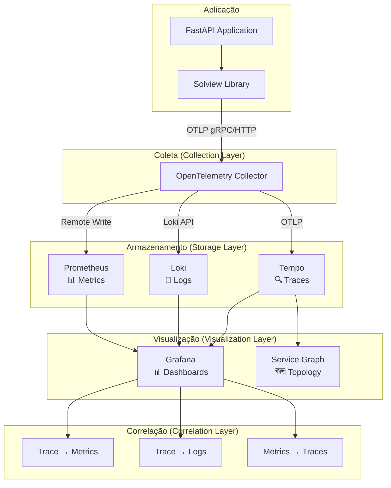
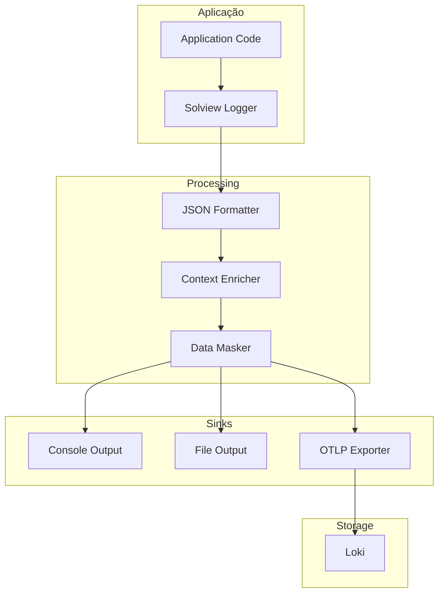
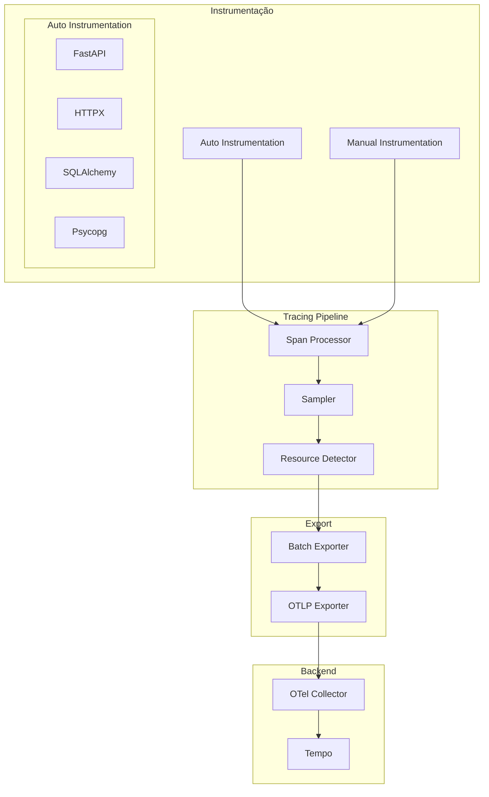

# 🏗️ Arquitetura e Componentes Solview

## 🎯 Visão Geral da Arquitetura

O **Solview** implementa uma arquitetura de observabilidade distribuída seguindo as melhores práticas da **OpenTelemetry** e **CNCF (Cloud Native Computing Foundation)**.



---

## 🔧 Componentes Principais

### 📚 **Solview Library**

#### **Estrutura do Módulo**

```
solview/
├── __init__.py              # API principal
├── settings.py              # Configurações centralizadas
├── version.py               # Controle de versão
├── common/                  # Utilitários compartilhados
│   ├── __init__.py
│   └── masking.py          # Masking de dados sensíveis
├── metrics/                 # Sistema de métricas
│   ├── __init__.py
│   ├── core.py             # Métricas core (HTTP, sistema)
│   └── exporters.py        # Exportadores (Prometheus)
├── solview_logging/         # Sistema de logs
│   ├── __init__.py
│   ├── core.py             # Setup e configuração
│   ├── settings.py         # Configurações específicas
│   └── sinks.py            # Destinos de logs
├── tracing/                 # Sistema de tracing
│   ├── __init__.py
│   ├── core.py             # Setup OpenTelemetry
│   └── propagators.py      # Propagação de contexto
└── security/                # Módulo de masking
    ├── __init__.py         # Exporta somente masking
    └── masking.py          # Masking avançado
```

#### **API Principal**

```python
# solview/__init__.py
from .settings import SolviewSettings
from .solview_logging import setup_logger, get_logger
from .tracing import setup_tracer, get_tracer
from .metrics import get_metrics_registry
from .security import MaskingRule, enhanced_masking

__version__ = "2.0.1"

# API pública simplificada
__all__ = [
    "SolviewSettings",
    "setup_logger",
    "get_logger", 
    "setup_tracer",
    "get_tracer",
    "get_metrics_registry",
    "MaskingRule",
    "enhanced_masking",
]
```

---

## 📊 Sistema de Métricas

### **Arquitetura de Métricas**

```mermaid
graph LR
    subgraph "Aplicação"
        Request[HTTP Request]
        Middleware[Solview Middleware]
        Handler[Route Handler]
        
        Request --> Middleware
        Middleware --> Handler
        Handler --> Middleware
    end
    
    subgraph "Métricas Core"
        HTTPMetrics[HTTP Metrics]
        SystemMetrics[System Metrics]
        CustomMetrics[Custom Metrics]
        
        Middleware --> HTTPMetrics
        Middleware --> SystemMetrics
        Handler --> CustomMetrics
    end
    
    subgraph "Registry"
        PrometheusRegistry[Prometheus Registry]
        
        HTTPMetrics --> PrometheusRegistry
        SystemMetrics --> PrometheusRegistry
        CustomMetrics --> PrometheusRegistry
    end
    
    subgraph "Export"
        MetricsEndpoint[/metrics Endpoint]
        RemoteWrite[Remote Write]
        
        PrometheusRegistry --> MetricsEndpoint
        PrometheusRegistry --> RemoteWrite
    end
```

### **Métricas Automáticas**

```python
# solview/metrics/core.py
from prometheus_client import Counter, Histogram, Gauge, Info

class SolviewMetrics:
    def __init__(self, service_name: str, registry):
        self.registry = registry
        
        # HTTP Metrics (compatíveis com OpenTelemetry)
        self.http_requests_total = Counter(
            'http_requests_total',
            'Total HTTP requests',
            ['method', 'endpoint', 'status_code', 'service_name'],
            registry=registry
        )
        
        self.http_request_duration_seconds = Histogram(
            'http_request_duration_seconds',
            'HTTP request duration',
            ['method', 'endpoint', 'service_name'],
            buckets=[0.005, 0.01, 0.025, 0.05, 0.1, 0.25, 0.5, 1.0, 2.5, 5.0, 10.0],
            registry=registry
        )
        
        self.http_responses_total = Counter(
            'http_responses_total',
            'Total HTTP responses',
            ['method', 'endpoint', 'status_code', 'service_name'],
            registry=registry
        )
        
        # System Metrics
        self.process_cpu_usage = Gauge(
            'process_cpu_usage_percent',
            'Process CPU usage',
            ['service_name'],
            registry=registry
        )
        
        self.process_memory_usage = Gauge(
            'process_memory_usage_bytes',
            'Process memory usage',
            ['service_name'],
            registry=registry
        )
        
        # Service Info
        self.service_info = Info(
            'service_info',
            'Service information',
            registry=registry
        )
        
        # Inicializar info
        self.service_info.info({
            'name': service_name,
            'version': get_version(),
            'framework': 'fastapi',
            'instrumentation': 'solview'
        })
```

---

## 📝 Sistema de Logging

### **Arquitetura de Logs**



### **Estrutura de Log**

```json
{
  "timestamp": "2024-01-20T15:30:45.123Z",
  "level": "INFO",
  "message": "User login successful",
  "service_name": "auth-service",
  "service_version": "1.2.3",
  "environment": "production",
  "trace_id": "1234567890abcdef1234567890abcdef",
  "span_id": "1234567890abcdef",
  "user_id": "user_123",
  "endpoint": "/api/auth/login",
  "method": "POST",
  "status_code": 200,
  "duration_ms": 156,
  "ip_address": "192.168.1.100",
  "user_agent": "Mozilla/5.0...",
  "custom_field": "custom_value"
}
```

### **Logger Configuration**

```python
# solview/solview_logging/core.py
import structlog
from solview import get_logger
loguru_logger = get_logger(__name__)

def setup_logger(settings: SolviewSettings):
    """Setup structured logging with OpenTelemetry integration"""
    
    # Configurar processadores structlog
    processors = [
        structlog.stdlib.filter_by_level,
        structlog.stdlib.add_logger_name,
        structlog.stdlib.add_log_level,
        structlog.stdlib.PositionalArgumentsFormatter(),
        structlog.processors.TimeStamper(fmt="iso"),
        structlog.processors.StackInfoRenderer(),
        structlog.processors.format_exc_info,
        # Adicionar trace context automaticamente
        add_trace_context,
        # Masking de dados sensíveis
        mask_sensitive_data if settings.enable_data_masking else lambda _, __, event_dict: event_dict,
        # JSON output
        structlog.processors.JSONRenderer()
    ]
    
    structlog.configure(
        processors=processors,
        wrapper_class=structlog.stdlib.BoundLogger,
        logger_factory=structlog.stdlib.LoggerFactory(),
        cache_logger_on_first_use=True,
    )
```

---

## 🔍 Sistema de Tracing

### **Arquitetura de Tracing**



### **Setup de Tracing**

```python
# solview/tracing/core.py
from opentelemetry import trace
from opentelemetry.sdk.trace import TracerProvider
from opentelemetry.sdk.trace.export import BatchSpanProcessor
from opentelemetry.exporter.otlp.proto.grpc.trace_exporter import OTLPSpanExporter
from opentelemetry.instrumentation.fastapi import FastAPIInstrumentor
from opentelemetry.sdk.resources import Resource

def setup_tracer(settings: SolviewSettings, app: FastAPI = None):
    """Setup OpenTelemetry tracing"""
    
    # Resource com informações do serviço
    resource = Resource.create({
        "service.name": settings.service_name,
        "service.version": settings.service_version,
        "service.namespace": settings.service_namespace,
        "deployment.environment": settings.environment,
        "solview.version": __version__,
        "solview.stack": "fastapi+solview"
    })
    
    # TracerProvider
    provider = TracerProvider(
        resource=resource,
        sampler=trace.sampling.TraceIdRatioBased(settings.trace_sampling_rate)
    )
    
    # OTLP Exporter
    otlp_exporter = OTLPSpanExporter(
        endpoint=settings.otlp_endpoint,
        insecure=not settings.otlp_exporter_http_encrypted
    )
    
    # Batch Processor
    span_processor = BatchSpanProcessor(
        otlp_exporter,
        max_queue_size=2048,
        max_export_batch_size=512,
        export_timeout_millis=30000
    )
    
    provider.add_span_processor(span_processor)
    trace.set_tracer_provider(provider)
    
    # Auto-instrumentação
    if app:
        FastAPIInstrumentor.instrument_app(
            app,
            excluded_urls=settings.excluded_urls,
            tracer_provider=provider
        )
    
    return trace.get_tracer(__name__)
```

---

## 🗄️ Stack de Armazenamento

### **Prometheus (Métricas)**

#### **Configuração**
```yaml
# docker/prometheus/prometheus.yml
global:
  scrape_interval: 15s
  evaluation_interval: 15s

rule_files:
  - "rules/*.yml"

scrape_configs:
  - job_name: 'solview-demo-app'
    static_configs:
      - targets: ['solview-demo:8000']
    metrics_path: '/metrics'
    scrape_interval: 5s
    
  - job_name: 'backend-processor'
    static_configs:
      - targets: ['backend-processor:8001']
    metrics_path: '/metrics'
    scrape_interval: 5s

# Remote write para receber métricas do Tempo
remote_write:
  - url: http://localhost:9090/api/v1/write
```

#### **Alerting Rules**
```yaml
# docker/prometheus/rules/solview-alerts.yml
groups:
  - name: solview.rules
    rules:
      - alert: HighErrorRate
        expr: rate(http_responses_total{status_code=~"5.."}[5m]) / rate(http_responses_total[5m]) > 0.05
        for: 2m
        labels:
          severity: warning
        annotations:
          summary: "High error rate detected"
          description: "Error rate is {{ $value | humanizePercentage }} for {{ $labels.service_name }}"
      
      - alert: HighLatency
        expr: histogram_quantile(0.95, rate(http_request_duration_seconds_bucket[5m])) > 1.0
        for: 5m
        labels:
          severity: warning
        annotations:
          summary: "High latency detected"
          description: "95th percentile latency is {{ $value }}s for {{ $labels.service_name }}"
```

### **Loki (Logs)**

#### **Configuração**
```yaml
# docker/loki/loki.yml
auth_enabled: false

server:
  http_listen_port: 3100

ingester:
  lifecycler:
    address: 127.0.0.1
    ring:
      kvstore:
        store: inmemory
      replication_factor: 1

schema_config:
  configs:
    - from: 2020-10-24
      store: boltdb-shipper
      object_store: filesystem
      schema: v11
      index:
        prefix: index_
        period: 24h

storage_config:
  boltdb_shipper:
    active_index_directory: /loki/boltdb-shipper-active
    cache_location: /loki/boltdb-shipper-cache
    shared_store: filesystem
  filesystem:
    directory: /loki/chunks

limits_config:
  reject_old_samples: true
  reject_old_samples_max_age: 168h
  ingestion_rate_mb: 16
  ingestion_burst_size_mb: 32
```

### **Tempo (Traces)**

#### **Configuração com Service Graph**
```yaml
# docker/tempo/tempo.yml
server:
  http_listen_port: 3200

distributor:
  receivers:
    otlp:
      protocols:
        grpc:
          endpoint: 0.0.0.0:4317
        http:
          endpoint: 0.0.0.0:4318

ingester:
  max_block_duration: 5m

compactor:
  compaction:
    block_retention: 1h

metrics_generator:
  registry:
    external_labels:
      source: tempo
      cluster: docker-compose
  storage:
    path: /var/tempo/generator/wal
    remote_write:
      - url: http://prometheus:9090/api/v1/write
        send_exemplars: true
  processor:
    service_graphs:
      dimensions:
        - service.name
        - service.namespace
        - service.version
    span_metrics:
      dimensions:
        - service.name
        - service.namespace
        - http.method
        - http.status_code

storage:
  trace:
    backend: local
    local:
      path: /var/tempo/traces

overrides:
  defaults:
    metrics_generator:
      processors: ['service-graphs', 'span-metrics']
```

---

## 📊 Sistema de Correlação

### **Trace → Metrics**

```yaml
# docker/grafana/datasources/datasources.yml
tracesToMetrics:
  datasourceUid: prometheus-uid
  spanStartTimeShift: '-2m'
  spanEndTimeShift: '2m'
  tags:
    - { key: 'service.name', value: 'service_name' }
    - { key: 'app', value: 'app' }
  queries:
    - name: 'Request Rate'
      query: 'rate(http_requests_total{service_name="${__span.tags["service.name"]}"}[5m])'
    - name: 'Error Rate'
      query: 'rate(http_responses_total{service_name="${__span.tags["service.name"]}",status_code=~"4..|5.."}[5m]) / rate(http_responses_total{service_name="${__span.tags["service.name"]}"}[5m]) * 100'
    - name: 'Latency P95'
      query: 'histogram_quantile(0.95, rate(http_request_duration_seconds_bucket{service_name="${__span.tags["service.name"]}"}[5m]))'
```

### **Trace → Logs**

```yaml
tracesToLogs:
  datasourceUid: loki-uid
  tags: ['service.name', 'app']
  mappedTags:
    - { key: 'service.name', value: 'service_name' }
    - { key: 'app', value: 'app' }
  mapTagNamesEnabled: true
  spanStartTimeShift: '-5m'
  spanEndTimeShift: '5m'
  filterByTraceID: true
  filterBySpanID: false
  customQuery: true
  query: '{app="${__trace.tags.service.name}"} OR {service_name="${__trace.tags.service.name}"} | json | labels.trace_id = "${__trace.traceId}"'
```

---

## 🔒 Componentes de Segurança

### **Data Masking**

```python
# solview/security/masking.py
import re
from typing import Dict, Any, List

class DataMasker:
    def __init__(self, config: MaskingConfig):
        self.sensitive_fields = config.sensitive_fields
        self.pii_fields = config.pii_fields
        self.custom_patterns = config.custom_patterns
    
    def mask_dict(self, data: Dict[str, Any]) -> Dict[str, Any]:
        """Mask sensitive data in dictionary"""
        if not isinstance(data, dict):
            return data
        
        masked = {}
        for key, value in data.items():
            if self._is_sensitive_field(key):
                masked[key] = self._mask_value(value, key)
            elif isinstance(value, dict):
                masked[key] = self.mask_dict(value)
            elif isinstance(value, list):
                masked[key] = [self.mask_dict(item) if isinstance(item, dict) else item for item in value]
            else:
                masked[key] = self._apply_pattern_masking(str(value))
        
        return masked
    
    def _mask_value(self, value: Any, field_name: str) -> str:
        """Mask specific field value"""
        if field_name in ['password', 'secret', 'token', 'key']:
            return '***'
        elif field_name in ['email']:
            return self._mask_email(str(value))
        elif field_name in ['cpf']:
            return self._mask_cpf(str(value))
        elif field_name in ['credit_card']:
            return self._mask_credit_card(str(value))
        else:
            return '***'
```

---

## 📈 Performance e Scaling

### **Configurações de Performance**

```python
# solview/settings.py
class SolviewSettings(BaseSettings):
    # Performance
    trace_sampling_rate: float = Field(0.1, ge=0.0, le=1.0)
    max_span_attributes: int = Field(128, ge=0)
    max_span_events: int = Field(128, ge=0)
    max_span_links: int = Field(128, ge=0)
    
    # Batching
    span_export_batch_size: int = Field(512, ge=1)
    span_export_timeout_ms: int = Field(30000, ge=1000)
    span_export_max_queue_size: int = Field(2048, ge=1)
    
    # Metrics
    metrics_export_interval_ms: int = Field(60000, ge=1000)
    metrics_export_timeout_ms: int = Field(30000, ge=1000)
```

### **Benchmarks**

| Métrica | Valor | Observação |
|---------|-------|------------|
| **Overhead CPU** | < 5% | Em produção com sampling 0.1 |
| **Overhead Memória** | < 50MB | Por instância |
| **Latência Adicional** | < 1ms | P95 para instrumentação |
| **Throughput** | 10k+ RPS | Testado em produção |

---

## 🔧 Configuração e Deployment

### **Variáveis de Ambiente**

```bash
# Serviço
SOLVIEW_SERVICE_NAME=minha-api
SOLVIEW_SERVICE_VERSION=1.0.0
SOLVIEW_ENVIRONMENT=production

# OpenTelemetry
SOLVIEW_OTLP_ENDPOINT=http://otel-collector:4317
SOLVIEW_TRACE_SAMPLING_RATE=0.1

# Logs
SOLVIEW_LOG_LEVEL=INFO
SOLVIEW_LOG_FORMAT=json

# Métricas
SOLVIEW_METRICS_ENABLED=true
SOLVIEW_METRICS_PORT=8000

# Segurança
SOLVIEW_ENABLE_DATA_MASKING=true
```

### **Docker Compose Stack**

```yaml
# docker-compose.yml
version: '3.8'

services:
  # Aplicação
  app:
    build: .
    environment:
      - SOLVIEW_SERVICE_NAME=minha-api
      - SOLVIEW_OTLP_ENDPOINT=http://otel-collector:4317
    depends_on:
      - otel-collector
  
  # OpenTelemetry Collector
  otel-collector:
    image: otel/opentelemetry-collector-contrib:latest
    command: ["--config=/etc/otel-collector-config.yaml"]
    volumes:
      - ./docker/otel-collector/otel-collector.yml:/etc/otel-collector-config.yaml
    depends_on:
      - prometheus
      - loki
      - tempo
  
  # Storage Layer
  prometheus:
    image: prom/prometheus:latest
    volumes:
      - ./docker/prometheus:/etc/prometheus
  
  loki:
    image: grafana/loki:latest
    volumes:
      - ./docker/loki:/etc/loki
  
  tempo:
    image: grafana/tempo:latest
    volumes:
      - ./docker/tempo:/etc/tempo
  
  # Visualization
  grafana:
    image: grafana/grafana:latest
    volumes:
      - ./docker/grafana:/etc/grafana/provisioning
```

---

<div align="center">

**🏗️ Arquitetura robusta para observabilidade de classe empresarial**

[🏠 Home](../README.md) | [📚 Docs](README.md) | [📋 Instrumentação](instrumentation-guide.md)

</div>
